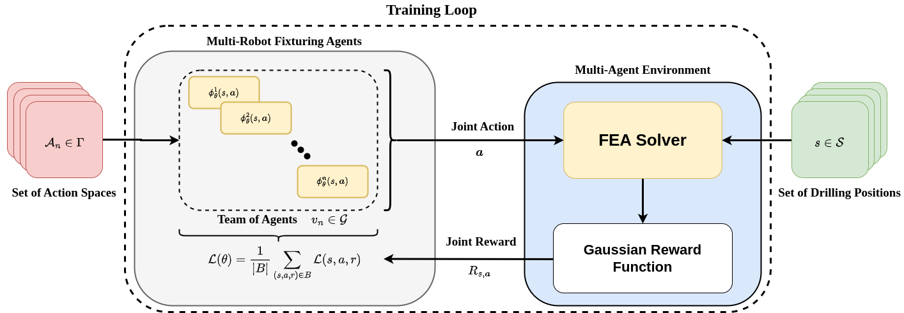

# Decision Making For Multi-Robot Fixture Planning Using Multi-Agent Reinforcement Learning

[](https://doi.org/10.1109/TASE.2024.3424677)
[](http://creativecommons.org/licenses/by/4.0/])

<p align="center">
  
</p>

**UPDATE 18/07/2024:** Our work was accepted for publication in IEEE Transactions on Automation Science & Engineering!

## Contents

- [Overview](#1)
- [Brief Synopsis](#2)
- [Manual Installation](#3)
  - [MATLAB Runtime Installation](#3a)
  - [Package Installation](#3b)
  - [Training](#3c)
  - [Inference](#3d)
- [Docker Container](#4)
  - [Setup](#4a)
  - [Usage](#4b)
- [Troubleshooting](#5)
  - [MATLAB Runtime Issues](#5a)
  - [Docker Execution Issues](#5b)
- [Citing This Work](#8)

<a id='1'></a>

## Overview

This is the repository to go along with the paper ["Decision Making For Multi-Robot Fixture Planning Using Multi-Agent Reinforcement Learning"](https://doi.org/10.1109/TASE.2024.34246771). This paper provides two representative models of an aerospace wing spar and wing panel and can be used for both training and inference.

This repo is split into two sections. The first requires the setup of the MATLAB Runtime and installation of Python packages in a virtual environment. This process is more complicated and may not work on older machines. The second (far easier) method is to use the Docker runtime and provided Docker image to run the training and inference process.

If you want to replicate our results, we provide network weights for each agent in the agent sets of 1 to 11 as in the work, with additional results regarding the determination of a Nash equilibrium in a single-stage game.

<a id='2'></a>

## Brief Synopsis

Fixture layout planning is the process of designing the layout for components undergoing a manufacturing task such as drilling or riveting ([Pehlivan & Summers, 2006](https://www.tandfonline.com/doi/abs/10.1080/00207540600865386)). In this process, the method aims to find positions for fixtures $A^*$ in such a way that they minimise any deformation or residual stresses that the component experiences during the task:

```math
A^* \in \underset{A \subseteq \mathcal{A}}{\text{argmin }} |f_w(\tau)|
```

Traditional methods have relied on optimisation techniques that search for a global minima in fixture positions that minimise the experienced deformation. However, these optimisation methods frequently enter local minima and believe they have found the global solution.

Reinforcement learning is a machine learning technique that seeks to learn optimal behaviour by having an agent interact within an environment and learn which actions produce the best rewards ([Sutton & Barto, 2018](http://incompleteideas.net/book/the-book-2nd.html)). In the multi-agent setting infinite-horizon setting, the agents are seeking to maximise their individual value function with respect to the other agents:

```math
V^n_{\pi^n, \boldsymbol{\pi}^{-n}}(s) = \mathbb{E}_{a_{t+1} \sim P, \boldsymbol{a}_t \sim \boldsymbol{\pi}} \left [ \sum_{t=0}^\infty \gamma^t R^n_t | s_0 = s\right ]
```

Due to the multi-agent setting, RL practitioners seek to embed game-theoretic guarantees in the learning stage of the agents. However, some instances only see global rewards returned to the agents, which leads to a field known as "team theory". Similar to game theory, it covers the cooperation of agents where the reward at each state is a function of the actions of all agents with no individual rewards. This leads to a player-by-player equilibrium, which is identical in nature to the Nash equilibrium ([van Schuppen, 2014](https://link.springer.com/chapter/10.1007/978-3-319-10407-2_18)):

```math
J(\{a^*_n, \boldsymbol{a}^*_{-n}\}) \leq J(\{a_n, \boldsymbol{a}^*_{-n}\})
```

When using robotic fixture elements, the elements can be reconfigured to multiple different drilling tasks and can find optimal fixture plans that can reduce deformation across multiple different positions.

<p align="center">
  
</p>

Where the task and component information (GREEN) are combined with reinforcement learning trained multi-agent systems (BLUE) to find fixture plans that reduce deformation across multiple drilling or milling positions (RED).

In this work we use reinforcement learning alongside team theory to create a mulit-agent framework for determining optimal fixture placement for multiple drilling tasks on aerospace components.

<a id='3'></a>

## Manual Installation

This work is built on two pillars: an FEA simulator developed in MATLAB and a multi-agent reinforcement learning process developed in Python. The system specs that the model was trained on is as follows:

```shell
OS: Ubuntu 20.04 LTS
Python Version: 3.10.10
GPU: NVIDIA GeForce RTX 3080
CPU: Intel Core i9-10920X 12C/24T
RAM: 64 GB
```

This work has only been tested on Ubuntu - there is currently no support for Windows and no plan to add support. Please submit a PR if wish to add Windows support.

<a id='3a'></a>

### MATLAB Runtime Installation

For starting the manual installation, firstly the MATALB runtime engine must be installed as it is used for the FEA simulation within the environment. The instructions to install the runtime can be found [here](https://uk.mathworks.com/help/compiler/install-the-matlab-runtime.html). The version of the runtime that the package was built with is R2023a and can be downloaded from here: [MATLAB Runtime R2023a](https://uk.mathworks.com/products/compiler/matlab-runtime.html).

Once you have downloaded the runtime, you can follow the instructions to install the runtime. The key part is to ensure that you retain the command shown below. This command is non-permanent and needs to be run every time a new terminal window is opened. Alternatively you can add this to your `~/.bashrc`.

```shell
export LD_LIBRARY_PATH="${LD_LIBRARY_PATH:+${LD_LIBRARY_PATH}:}\ 
  /path/to/install/dir/R2023a/runtime/glnxa64:\
  /path/to/install/dir/R2023a/bin/glnxa64:\
  /path/to/install/dir/R2023a/sys/os/glnxa64:\
  /path/to/install/dir/R2023a/extern/bin/glnxa64"
```

<a id='3b'></a>

### Package Installation

To install the necessary packages, it is recommended to use a virtual environment such as Ananconda or virtualenv. We will use Anaconda commands in this repo, but these could be substituted for other commands.

In the `manual` directory, use the provided `environment.yml` file to install all the necessary Python packages:

```shell
conda env create -f environment.yml
```

Once this is done, from the top level of this git repository, execute the following commands to install the wing panel FEA simulator package and the similar package for the wing spar FEA simulator:

```shell
# For the wing panel simulator
cd ./manual/train/calculateDeformationMARLTEST/for_redistribution_files_only
python3 setup.py install

# For the wing spar simulator
cd ./manual/train/calculateDeformationMARLSpar/for_redistribution_files_only
python3 setup.py install
```

The installation of the packages can be tested by running `import calculateDeformationMARL<type>` into a Python CLI instance, where `<type>` dictates either the panel (TEST) or spar (Spar) packages.

<a id='3c'></a>

### Training

For training the models, we provide a shell script that can be used to start a training process for both the spar and the panel models. The script must first be given executable privileges:

```shell
sudo chmod +x train_mafp.sh
```

To run the training cycle, execute the following command in the `/path/to/repo/manual/scripts/` folder:

```shell
./train_mafp.sh -e <env> -r <num runs> -n <num agents>
```

Where `env` is the environment to run (either panel or spar), `<num runs>` is the number of runs of the framework to run and `<num agents>` is the number of agents to use per run. These cannot be changed between runs. All hyperparameters are kept in the runner file. 

If you are using [Weights & Biases](https://wandb.ai/site) for logging, there are two optional arguments to pass that are required for logging:

```shell
./train_mafp.sh -e <env> -r <num runs> -n <num agents> -w -i <wandb identity>
```

Where `wandb identity` is your W&B account ID. Project name and run numbers are handled by the program config. All runs save the episodic reward, regret and step TD loss in CSV files, along with a network weights `.pt` file for each agent.

<a id='3d'></a>

### Inference

Once the agents have been trained, it is possible to run inference on the drilling positions. We provide a shell script to run inference for the agents. Similar to the training process, we first have to enable the script for execution:

```shell
sudo chmod +x eval_mafp.sh
```

Now you can run the script itself with the following parameters:

```shell
./eval_mafp.sh -e <env> -r <num runs> -n <num agents> -a <run name>
```

The flags `-e -r` and `-n` are identical to the flags in the train script. The main difference is the `-a` flag, which specifies which run you want to use to evaluation.

We provide networks weights for evaluation from our testing. They can be found in the `train/agent_weights` directory. To run the `eval` weights:

```shell
./eval_mafp.sh -e <env> -r <num runs> -n <num agents> -a eval
```

<a id='4'></a>

## Docker Container

<a id='4a'></a>

### Setup

To begin using the provided Dockerfile, you must first ensure that you have the Docker engine installed on your computer. Unlike the manual method above, this method will work on any `x86` operating system that has the Docker runtime. Make sure that you install Docker from this [link](https://docs.docker.com/engine/install/).

The base image we use in our `dockerfile` is a [pre-defined image from NVIDIA](https://hub.docker.com/layers/nvidia/cuda/11.7.1-base-ubuntu20.04/images/sha256-27e5e7a6ab2238a70200083bc841c87dd3b70cac27136a63b4b5b398147ab747) that allows the passthrough of any GPUs in the system for accelerated machine learning. However, to enable this feature the NVIDIA Container Toolkit must be installed on the host machine. Currently this is only support on Linux-based machines. First configure the production repository:

```shell
curl -fsSL https://nvidia.github.io/libnvidia-container/gpgkey | sudo gpg --dearmor -o /usr/share/keyrings/nvidia-container-toolkit-keyring.gpg \
  && curl -s -L https://nvidia.github.io/libnvidia-container/stable/deb/nvidia-container-toolkit.list | \
    sed 's#deb https://#deb [signed-by=/usr/share/keyrings/nvidia-container-toolkit-keyring.gpg] https://#g' | \
    sudo tee /etc/apt/sources.list.d/nvidia-container-toolkit.list
```

Then run:

```shell
sudo apt update && sudo apt install -y nvidia-container-toolkit
```

This installs the toolkit. For a more detailed installation and troubleshooting help, consult NVIDIA's help page: [NVIDIA Container Toolkit](https://docs.nvidia.com/datacenter/cloud-native/container-toolkit/latest/install-guide.html).

<a id='4b'></a>

### Usage

In the top level of this repo, run the docker imaging command for this dockerfile:

```shell
docker build -f Dockerfile -t mafp .
```

This process can take a few minutes as the base image is quite large. Once this has finished, execute the following command to run the training method for the agents:

```shell
docker run --runtime=nvidia --gpus all \
    --mount type=bind,source=$PWD,target=/home/code \
    mafp \
    bash -c \
    "cd /home/code/manual/scripts && \
    ./train_mafp.sh -e <env> -r <num runs> -n <num agents> -w -i <wandb identity>"
```

When this container exits, the corresponding results files will be stored in the same location as if trained on your host machine in `/manual/runs_csv/`. 

To run the inference step, run the following command:

```shell
docker run --runtime=nvidia --gpus all \
    --mount type=bind,source=$PWD,target=/home/code \
    mafp \
    bash -c \
    "cd /home/code/manual/scripts && \
    ./eval_mafp.sh -e <env> -r <num runs> -n <num agents> -a eval"
```

As with the training process, all output files are stored in the `manual/runs_csv` folder in this cloned repo.

**NOTE**: Each time these commands are executed, the docker runtime creates a new container with a new ID. These containers should be managed efficiently based on your systems specs. 

<a id='5'></a>

## Troubleshooting

<a id='5a'></a>

### MATLAB Runtime Issues

One of the more common errors is the initialisation of the MATLAB Runtime to run the training and inference scripts. The error has some form of (with variation depending on whether your `LD_LIBRARY_PATH` has contents):

```shell
RuntimeError: On Linux, you must set the environment variable "LD_LIBRARY_PATH" to a non-empty string. For more details, see the package documentation.
```

The solution is to ensure that you have installed the MATLAB Runtime as detailed above, and that **you add the MATLAB Runtime to your `LD_LIBRARY_PATH` whenever you open a new terminal window**. To check whether the MATLAB Runtime is on the path, execute the command:

```shell
echo $LD_LIBRARY_PATH
```

The response should show the location of the MATLAB Runtime on your system.

<a id='5b'></a>

### Docker Execution Issues

When using the provided Docker container on WSL 2 with Docker Desktop For Windows, the NVIDIA Container Toolkit does not function as the Docker runtime is not installed on the WSL 2 installation. To fix this, you will need to enabled CUDA Acceleration for WSL 2. The full documentation can be found here: [NVIDIA CUDA Acceleration for WSL 2](https://docs.nvidia.com/cuda/wsl-user-guide/index.html). 

With running the containers on WSL 2, another know error occurs during execution of the commands:

```shell
docker: Error response from daemon: unknown or invalid runtime name: nvidia. 
```

When using WSL 2 and the NVIDIA CUDA acceleration layer, the `--runtime=nvidia` flag is not needed as the NVIDIA Container runtime is not installed. Therefore it can be removed when working on WSL 2

A best practise when using these images and containers is to keep track of container sizes. The size of some of the containers and images can reach 25 GB, and the Docker build command provided creates a new container each time. Therefore, it is heavily advised to remove older containers and images that are not being used before creating new ones.  

<a id='6'></a>

## Citing This Work

If you want to cite this work, please refer to our [full paper in IEEE T-ASE](https://doi.org/10.1109/TASE.2024.3424677) and cite us using the format below:

```bibtex
 @article{marl_fixtures_2023, 
     title={Decision Making for Multi-Robot Fixture Planning Using Multi-Agent Reinforcement Learning}, 
     rights={All rights reserved}, 
     ISSN={1558-3783}, 
     DOI={10.1109/TASE.2024.3424677}, 
     journal={IEEE Transactions on Automation Science and Engineering}, 
     author={Canzini, Ethan and Auledas-Noguera, Marc and Pope, Simon and Tiwari, Ashutosh}, year={2024}, pages={1–12}
 }
```

Any questions, please forward them to: <e.a.canzini@sheffield.ac.uk>. If you want to use our approach and want advice, feel free to reach out! Pull requests for other functionality (new models, different RL algorithms, bug fixes etc.) are welcome.
