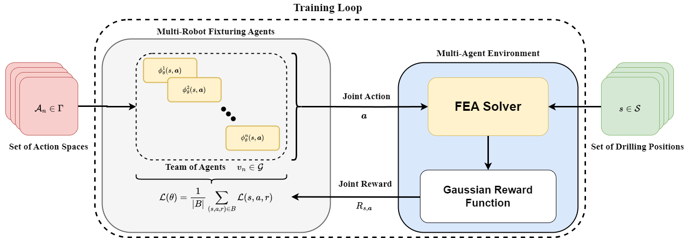

# Decision Making For Multi-Robot Fixture Planning Using Multi-Agent Reinforcement Learning

[](https://opensource.org/licenses/MIT)

<p align="center">
  
</p>

## Contents

- [Overview](#1)
- [Manual Installation & Training](#2)
- [Docker Container](#3)
- [Troubleshooting](#4)
- [Citing This Work](#5)

<a id='1'></a>

## Overview

This is the repository to go along with the paper "Decision Making For Multi-Robot Fixture Planning Using Multi-Agent Reinforcement Learning". This paper provides two representative models of an aerospace wing spar and wing panel and can be used for both training and inference.

This repo is split into two sections. The first requires the setup of the MATLAB Runtime and installation of Python packages in a virtual environment. This process is more complicated and may not work on older machines. The second (far easier) method is to use the Docker runtime and provided Docker image to run the training and inference process.

If you want to replicate our results, we provide network weights for each agent from 1 to 11, with additional results regarding the determination of a Nash equilibrium in a single-stage game.

<a id='2'></a>

## Manual Installation & Training

<a id='3'></a>

## Docker Container

<a id='4'></a>

## Troubleshooting

<a id='5'></a>

## Citing This Work

If you want to cite this work, please refer to our preprint on TechXriv:

```bibtex
 @article{marl_fixtures, 
    type={preprint}, 
    title={Decision Making For Multi-Robot Fixture Planning Using Multi Agent Reinforcement Learning}, 
    DOI={10.36227/techrxiv.24171534.v1}, 
    publisher={TechRxiv}, 
    author={Canzini, Ethan and Auledas Noguera, Marc and Pope, Simon and Tiwari, Ashutosh}, 
    year={2023}, 
    month=oct, 
    language={en} 
 }

```

Any questions, please forward them to: <ecanzini1@sheffield.ac.uk>. If you want to use our approach and want advice, feel free to reach out!
